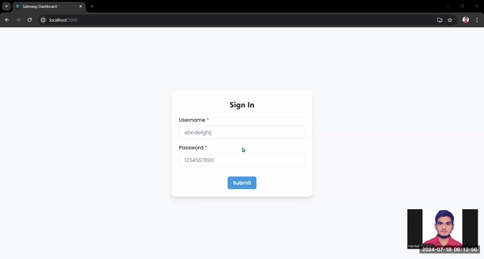

# Salesway Dashboard Assignment

Welcome to the Salesway Dashboard, a comprehensive tool designed for visualizing and managing sales data effectively. This dashboard offers a seamless user experience with various features to enhance data visualization and analysis, while ensuring secure access and robust error handling.

## Features:

- Bar Graphs for Data Visualization: Interactive bar graphs to visualize sales data, making it easy to identify trends and patterns.
- Progress Bars: Provides visual indicators of progress towards sales targets and other key metrics.
- Error Handling in UI: Robust error handling to ensure smooth user experience, with clear messages and fallback options in case of any issues.
- Backend API for Data Storing: A fully-featured backend API to handle data storage, retrieval, and management, ensuring data persistence and integrity.

## Project Demonstration

**Image Preview:**



**Video Overview:**

[View Video](https://drive.google.com/file/d/1gbW4YTA8xGN3t534vM_oF4bJPZUp1mK5/view?usp=sharing)

## Getting Started

**First, clone the repository:**

```bash
git clone https://github.com/Hashal890/salesway-dashboard-assignment.git
cd salesway-dashboard-assignment
```

### Front-End Setup

Navigate to the `frontend` directory and install dependencies:

```bash
cd frontend
npm install
# or
yarn install
# or
pnpm install
# or
bun install
```

Run the development server:

```bash
npm run start
# or
yarn start
# or
pnpm start
# or
bun start
```

### Back-End Setup

Navigate to the `backend` directory and install dependencies:

```bash
cd backend
npm install
# or
yarn install
# or
pnpm install
# or
bun install
```

Run the back-end server:

```bash
npm run dev
# or
yarn dev
# or
pnpm dev
# or
bun dev
```

## Technologies used

- [Mongoose](https://mongoosejs.com/docs/guide.html)
- [Express.js](https://expressjs.com/en/starter/installing.html)
- [React.js](https://nextjs.org/docs)
- [JavaScript](https://developer.mozilla.org/en-US/docs/Web/JavaScript)
- [Axios](https://www.npmjs.com/package/axios)
- [Body Parser](https://www.npmjs.com/package/body-parser)
- [Dotenv](https://www.npmjs.com/package/dotenv)
- [Cors](https://www.npmjs.com/package/cors)
- [Chakra-UI](https://v2.chakra-ui.com/getting-started)
- [Chart.js](https://www.chartjs.org/docs/latest/)
- [React Chart.js 2](https://www.npmjs.com/package/react-chartjs-2)
- [React Icons](https://react-icons.github.io/react-icons/)
- [CSS](https://developer.mozilla.org/en-US/docs/Web/CSS)
- [HTML](https://developer.mozilla.org/en-US/docs/Web/HTML)
- [Vercel](https://vercel.com/)
